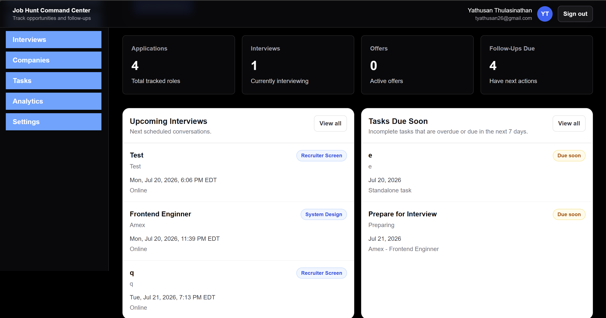
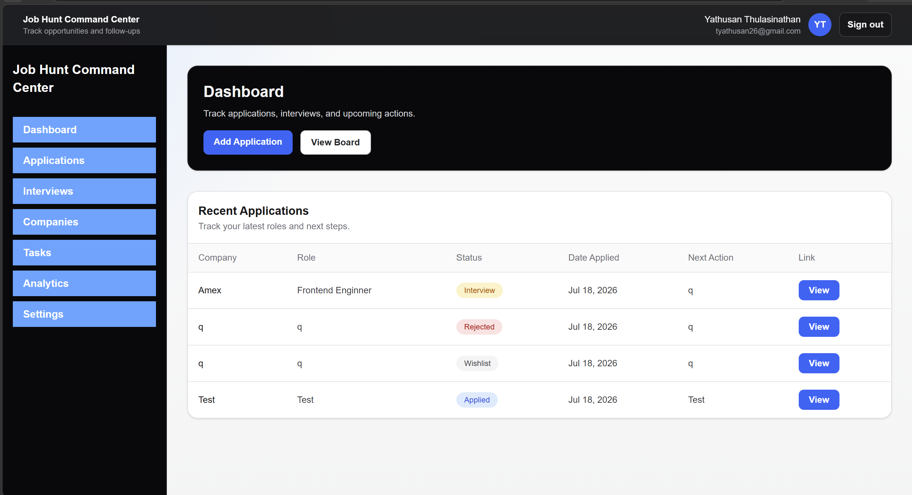

# Job Hunt Command Center

A full-stack job application tracking platform for managing job applications, companies, statuses, notes, and next actions through a clean dashboard interface.

## Overview

Job Hunt Command Center helps users organize their job search by tracking applications, company details, application statuses, job links, notes, and follow-up actions in one place.

This project is being built as a portfolio-grade full-stack application to practice modern web development, relational database design, full-stack CRUD workflows, and local development infrastructure.

## Tech Stack

* **Framework:** Next.js
* **Language:** TypeScript
* **Styling:** Tailwind CSS
* **Database:** PostgreSQL
* **ORM:** Prisma
* **Local Development:** Docker
* **UI:** React components
* **Authentication:** Auth.js

## Features

### Completed

* Dashboard with application metrics
* Applications table
* Dedicated applications page
* Create, view, edit, and delete job applications
* Application detail pages
* Reusable application form for create and edit flows
* Company/application relationship using PostgreSQL
* Application status tracking
* Job URL, notes, next action, and date applied fields
* Server-side database access with Prisma
* Prisma migrations and seed data
* Local PostgreSQL development using Docker
* Prisma Studio support for database inspection
* Application search and filtering
* Companies page
* Company detail page
* Board/Kanban-style application view
* Authentication
* User-specific application tracking
* Interview scheduling for job applications
* Interview stage, format, date/time, and notes tracking

### In Progress / Planned

* Task management
* Dashboard widgets for upcoming interviews and due tasks
* Analytics dashboard
* Reminder workflows
* Deployment

## Screenshots

Screenshots will be added as the project UI develops.

Example paths:

```md


```

## Project Status

This project is currently in development.

Current progress:

* [x] Frontend dashboard shell
* [x] PostgreSQL and Prisma integration
* [x] Application CRUD
* [x] Applications page
* [x] Search and filtering
* [x] Companies page
* [x] Company detail page
* [x] Board view of applications
* [x] Authentication
* [x] User-specific application tracking
* [x] Interview tracking
* [ ] Task management
* [ ] Dashboard interview/task widgets
* [ ] Analytics
* [ ] Reminder system
* [ ] Deployment

## Database Schema

Current main models:

* `User`
* `Account`
* `Session`
* `VerificationToken`
* `Company`
* `Application`
* `Interview`
* `Task`


A company can have many applications, and each application belongs to one company.

Current relationship:

```txt
Company 1 ---- * Application
```

Additional relationships:

```txt
User 1 -------- * Company
User 1 -------- * Application
User 1 -------- * Interview
User 1 -------- * Task

Application 1 -- * Interview
Application 1 -- * Task
```

## Getting Started

### 1. Clone the repository

```bash
git clone https://github.com/your-username/job-hunt-command-center.git
cd job-hunt-command-center
```

### 2. Install dependencies

```bash
npm install
```

### 3. Set up environment variables

Create a `.env` file in the project root.

Copy `.env.example` to `.env`, then replace the placeholder values with your own local environment values.

### 4. Start PostgreSQL with Docker

Make sure Docker is running, then run:

```bash
docker compose up -d
```

### 5. Run Prisma migrations

```bash
npx prisma migrate dev
```

### 6. Generate Prisma Client

```bash
npx prisma generate
```

### 7. Seed the database

```bash
npx prisma db seed
```

### 8. Start the development server

```bash
npm run dev
```

Then open:

```txt
http://localhost:3000
```

## Useful Commands

Start the development server:

```bash
npm run dev
```

Start PostgreSQL:

```bash
docker compose up -d
```

Safely stop PostgreSQL:

```bash
docker compose stop
```

Open Prisma Studio:

```bash
npx prisma studio
```

Run migrations:

```bash
npx prisma migrate dev
```

Seed the database:

```bash
npx prisma db seed
```

Generate secret authentication code:

```bash
npx auth secret
```

## Environment Variables

| Variable             | Description                                 |
|----------------------|---------------------------------------------|
| `DATABASE_URL`       | PostgreSQL connection string used by Prisma |
| `AUTH_SECRET` | Secret used by Auth.js to sign and encrypt authentication data. Generate a strong random value and keep it private. |
| `AUTH_GITHUB_ID` | GitHub OAuth app client ID used for GitHub sign-in. |
| `AUTH_GITHUB_SECRET` | GitHub OAuth app client secret used for GitHub sign-in. Keep this private. |
## Folder Structure

```txt
job-hunt-command-center/
|-- app/
|   |-- dashboard/
|   |-- applications/
|   |-- companies/
|   |-- interviews/
|   |-- tasks/
|   `-- page.tsx
|-- components/
|   |-- dashboard/
|   |-- applications/
|   |-- companies/
|   |-- interviews/
|   |-- tasks/
|   `-- layout/
|-- lib/
|   |-- actions/
|   |-- current-user.ts
|   |-- data.ts
|   |-- prisma.ts
|   `-- types.ts
|-- prisma/
|   |-- schema.prisma
|   `-- seed.ts
|-- public/
|-- docker-compose.yml
|-- package.json
`-- README.md
```

## What I Learned

This project helped me practice:

* Building reusable React components
* Structuring a Next.js App Router project
* Using TypeScript for safer component props and data models
* Modeling relational data with PostgreSQL
* Querying a database with Prisma
* Creating full-stack CRUD flows
* Reusing form components for create and edit workflows
* Managing local PostgreSQL development with Docker
* Using Prisma migrations and seed data
* Debugging TypeScript errors between UI types and database types
* Designing optional relationships in Prisma for tasks that may or may not belong to an application
* Building user-owned interview and task workflows
* Modeling workflow data such as interview stages, task due dates, and completion state
* Extending an existing full-stack app without breaking authentication or authorization rules

## Roadmap

* [x] Build dashboard UI
* [x] Add reusable metric cards and application table
* [x] Set up PostgreSQL with Docker
* [x] Add Prisma schema and migrations
* [x] Seed database with sample data
* [x] Replace mock data with real database queries
* [x] Add application detail pages
* [x] Add create application flow
* [x] Add edit application flow
* [x] Add delete application flow
* [x] Add dedicated applications page
* [x] Add search and filters
* [x] Add companies page
* [x] Add company detail page
* [x] Add board/Kanban view by status
* [x] Add authentication
* [x] Scope data to authenticated users
* [ ] Add analytics dashboard
* [x] Add interview schema and application interview tracking
* [ ] Add task schema and task management page
* [ ] Add task completion workflow
* [ ] Add upcoming interviews to dashboard
* [ ] Add due tasks to dashboard
* [ ] Add reminder workflows
* [ ] Deploy application

## Future Improvements

Potential future upgrades include:


* Resume and cover letter version tracking
* Interview scheduling
* Follow-up reminders
* Application analytics
* CSV export
* Deployment with a production PostgreSQL database

## Resume Summary

Job Hunt Command Center is a full-stack job application tracking platform built with Next.js, TypeScript, PostgreSQL, Prisma, Tailwind CSS, Docker, and Auth.js. The project includes GitHub OAuth authentication, user-scoped application tracking, company management, application CRUD workflows, board views, relational database modeling, reusable React components, and local containerized database development. Interview and task management workflows are currently being added to support follow-ups, scheduling, and job-search planning.
## License

MIT
